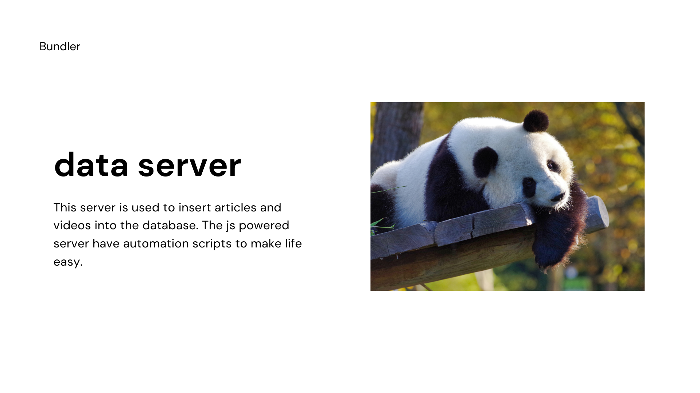

# Data Server


This server have endpoints to append articles and youtube videos into mongoDB. 

**Make sure the Schema inside /models are always equal to Schema inside user-server.**


Here's the [Postman Collection](https://drive.google.com/file/d/1qG8_AkKx5VkseMLezoPZU36bQeIDFMT2/view?usp=sharing).

###### Singleton insertion Endpoints

```
localhost:5002/data/articles?title={here-comes-the-title}
localhost:5002/data/videos?title={here-comes-the-title}}
```

###### Automate insertion

Run the automation.js to automatically insert data for each tag in profession. ( Please don't play with this)

Output from automation.js

```
staring article automation 
- agriculture
-- Agriculture
-- Farming
-- Food
-- Sustainability
-- Technology
-- Environment
-- International Development
-- Africa
-- Food Security
-- Agricultura
- architecture
-- Architecture
-- Construction
-- Design
-- Engineering
-- Building
-- Bim
-- Interior Design
-- Real Estate
-- Construction Industry
-- Sustainability
- education
-- Education
-- Teaching
-- Learning
-- Schools
-- Technology
-- Life Lessons
-- Education Reform
-- Higher Education
-- CollegeLife
- business
-- Business Management
-- Business
-- Business Strategy
-- Leadership
-- Entrepreneurship
-- Startup
-- Management
-- Product Management
-- Project Management
-- Productivity
- science
-- Science And Engineering
-- Education
-- Scholarship
-- Academic City
-- Data Science
-- Engineering
-- Science
-- Machine Learning
-- Web development
-- Python
-- Javascript
-- React
-- DevOps
-- Android
-- Kotlin
-- flutter
-- ktor
-- Nodejs
-- Backend
- marketing
-- Marketing
-- Business
-- Social Media
-- Startup
-- Entrepreneurship
-- Digital Marketing
-- Content Marketing
-- Social Media Marketing
-- Writing
-- Advertising
---completed  Agriculture
---completed  Business
---completed  Africa
---completed  Farming
---completed  React
---completed  Entrepreneurship
---completed  Technology
---completed  Leadership
---completed  Business
---completed  Kotlin
---completed  Digital Marketing
---completed  Machine Learning
---completed  Agricultura
---completed  Content Marketing
---completed  Social Media Marketing
---completed  Academic City
---completed  Social Media
---completed  Business Management
---completed  Life Lessons
---completed  Food Security
---completed  Building
---completed  Architecture
---completed  Data Science
---completed  Design
---completed  Engineering
---completed  Project Management
---completed  Startup
---completed  Productivity
---completed  Marketing
---completed  Android
---completed  Teaching
---completed  International Development
---completed  Engineering
---completed  Interior Design
---completed  Javascript
---completed  Nodejs
---completed  Scholarship
---completed  Entrepreneurship
---completed  Startup
---completed  Business Strategy
---completed  Science And Engineering
---completed  Backend
---completed  Technology
---completed  Advertising
---completed  Schools
---completed  Python
---completed  flutter
---completed  Education
---completed  Product Management
---completed  DevOps
---completed  Environment
---completed  Sustainability
---completed  Education
---completed  Construction Industry
---completed  Real Estate
---completed  Bim
---completed  Higher Education
---completed  Science
---completed  Web development
---completed  Writing
---completed  Learning
---completed  Education Reform
---completed  Sustainability
---completed  CollegeLife
---completed  ktor
---completed  Management
---completed  Construction
---completed  Food
```


#### How to run this?

This server runs at PORT 5002 (again mentioning don't change the PORT while testing any NOF server)

```
git clone https://github.com/N-O-F/data-server.git
cd data-server
npm i
npm run startDev
```


##### Automation Rocks 🚀
